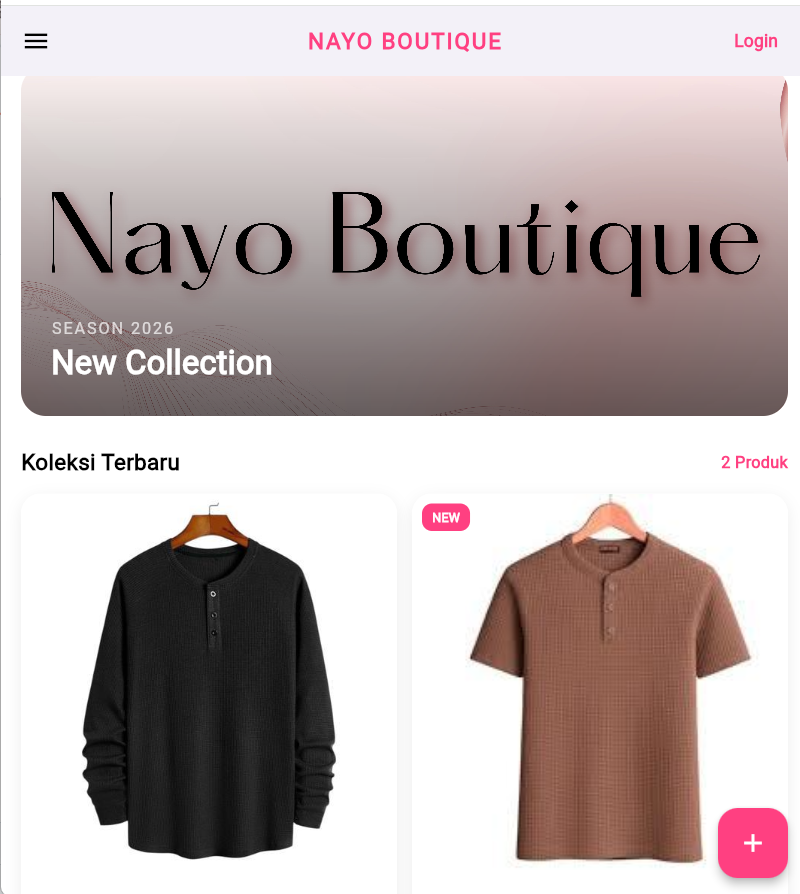

# 🛍️ Nayo Boutique
Aplikasi manajemen produk butik berbasis Flutter.

| ✨ Nama Lengkap              | 🆔 NIM        | 📚 Kelas                 |
|------------------------------|---------------|--------------------------|
| **Indah Maramin Al Inayah**  | 2409116086    | Sistem Informasi C 2024  |

---

## Deskripsi Aplikasi

Aplikasi Nayo Boutique merupakan aplikasi berbasis Flutter yang dibuat untuk mengelola data produk butik. Aplikasi ini memungkinkan pengguna untuk melakukan registrasi akun, login, menambahkan, mengedit, dan menghapus data produk secara dinamis.

Setiap produk memiliki informasi berupa nama produk, harga, stok, dan foto produk. Data produk disimpan pada database menggunakan Supabase, sedangkan gambar produk disimpan pada Supabase Storage. Aplikasi ini juga menggunakan konsep State Management dengan StatefulWidget dan setState() untuk memperbarui tampilan secara real-time setelah terjadi perubahan data.

Aplikasi ini dibuat sebagai implementasi dari materi Widget Dasar, State Management Dasar, Form Input, Navigasi Antar Halaman, dan Integrasi Backend pada mata kuliah Mobile Application Programming, dengan tujuan memahami cara kerja perubahan state, autentikasi pengguna, serta pengelolaan data berbasis cloud.

---

## Fitur Aplikasi

<b>1. Halaman Utama</b>

 

  
  
  

  <b><em>Halaman Utama</em></b> 
  Halaman utama menampilkan daftar produk yang diambil dari database Supabase. 
  Jika belum ada produk yang tersedia, maka akan muncul pesan 
  <b>"Belum ada produk 🛍️"</b> sebagai indikator bahwa data masih kosong.
    
  Pada halaman ini juga terdapat beberapa komponen utama, yaitu:
   
  - Banner aplikasi sebagai identitas visual 
  - Judul aplikasi di bagian atas halaman 
  - Tombol Login pada AppBar 
  - FloatingActionButton (+) untuk menambahkan produk baru 
  - Grid daftar produk yang menampilkan foto, nama, harga, dan stok 
  

 

<b>2. Registrasi Akun</b>

 

  
  
  

  <b><em>Registrasi Akun</em></b> 
  Pengguna dapat membuat akun baru dengan mengisi nama lengkap, email, kata sandi, dan konfirmasi kata sandi.
    
  Pada proses registrasi, aplikasi akan melakukan validasi:
   
  - Semua field wajib diisi 
  - Kata sandi dan konfirmasi kata sandi harus sama 
  - Kata sandi minimal 6 karakter 
   
  Jika berhasil, akun akan didaftarkan ke Supabase Auth dan pengguna akan diarahkan ke halaman login.
  

 

<b>3. Login Pengguna</b>

 

  
  
  

  <b><em>Login Pengguna</em></b> 
  Pengguna dapat masuk ke aplikasi menggunakan email dan kata sandi yang telah terdaftar.
    
  Halaman login dilengkapi dengan beberapa fitur, yaitu:
   
  - Validasi input email dan kata sandi 
  - Tombol show/hide password 
  - Fitur <b>Lupa Kata Sandi</b> 
  - Notifikasi login berhasil atau gagal menggunakan SnackBar 
  

 

<b>4. Menambahkan Produk Baru</b>

 

  
  
  

  <b><em>Menambahkan Produk Baru</em></b> 
  Pengguna dapat menambahkan produk baru dengan mengisi nama produk, harga, stok, dan memilih foto produk melalui halaman form.
    
  Data yang dimasukkan akan divalidasi terlebih dahulu, kemudian disimpan ke tabel 
  <b>produk</b> pada database Supabase. Jika pengguna memilih gambar, maka gambar akan diunggah ke 
  <b>Supabase Storage</b>.
  

 

<b>5. Menampilkan Daftar Produk</b>

 

  

  

  <b><em>Menampilkan Daftar Produk</em></b> 
  Aplikasi menampilkan daftar produk dalam bentuk card/grid. 
  Setiap card berisi informasi foto produk, nama produk, harga, dan stok yang tersedia.
  Data akan ditampilkan secara dinamis setelah berhasil diambil dari database.
  

 

<b>6. Empty State (Belum Ada Produk)</b>

 

  
  
  

  <b><em>Empty State</em></b> 
  Jika belum ada produk yang tersimpan pada database, aplikasi akan menampilkan pesan 
  <b>"Belum ada produk 🛍️"</b> sebagai indikator bahwa daftar produk masih kosong.
  

 

<b>7. Mengedit Produk</b>

 

  

  

  <b><em>Mengedit Produk</em></b> 
  Pengguna dapat mengubah data produk yang telah ditambahkan melalui tombol edit atau dengan menekan card produk.
  Setelah perubahan disimpan, data pada halaman utama akan langsung diperbarui kembali dari database.
  

 

<b>8. Menghapus Produk dengan Konfirmasi</b>

 

  

  

  <b><em>Menghapus Produk</em></b> 
  Pengguna dapat menghapus produk melalui tombol hapus. 
  Sebelum data dihapus secara permanen, akan muncul dialog konfirmasi 
  untuk memastikan tindakan pengguna.
  

 

<b>9. Upload dan Preview Foto Produk</b>

 

  
  
  

  <b><em>Upload dan Preview Foto Produk</em></b> 
  Aplikasi mendukung pemilihan gambar produk dari galeri menggunakan <b>image_picker</b>.
    
  Setelah gambar dipilih, aplikasi akan menampilkan preview gambar sebelum data disimpan.
  Pengguna juga dapat:
   
  - Mengganti gambar yang dipilih 
  - Menghapus gambar yang dipilih 
  - Menampilkan foto lama saat proses edit produk 
   
  Foto produk yang berhasil diunggah akan disimpan di bucket <b>produk-images</b> pada Supabase Storage.
  

 

<b>10. Notifikasi Aksi (SnackBar)</b>

 

  

  

  <b><em>Notifikasi Aksi</em></b> 
  Aplikasi menampilkan notifikasi (SnackBar) setelah berhasil melakukan aksi seperti login, registrasi, menambahkan produk, mengedit produk, menghapus produk, maupun saat terjadi kesalahan sebagai bentuk feedback kepada pengguna.
  

 

---

## 3. Widget yang Digunakan  

Berikut adalah widget yang digunakan dalam pengembangan aplikasi **Nayo Boutique** beserta fungsinya:

- **`MaterialApp`**: Digunakan sebagai root aplikasi yang menerapkan desain Material Design serta mengatur tema dan struktur dasar aplikasi.

- **`Scaffold`**: Berfungsi sebagai kerangka utama halaman yang terdiri dari AppBar, Body, dan FloatingActionButton.

- **`AppBar`**: Digunakan untuk menampilkan judul aplikasi, tombol login, dan navigasi pada bagian atas layar.

- **`Column & Row`**:  
  Column digunakan untuk menyusun widget secara vertikal, sedangkan Row digunakan untuk menyusun widget secara horizontal.

- **`Container`**: Digunakan untuk mengatur ukuran, margin, padding, serta dekorasi pada tampilan.

- **`SingleChildScrollView`**: Digunakan agar halaman dapat digulir, terutama pada form dan halaman autentikasi.

- **`GridView.builder`**: Digunakan untuk menampilkan daftar produk secara dinamis dalam bentuk grid berdasarkan data yang tersedia.

- **`Card / Container`**: Digunakan untuk menampilkan informasi produk dalam tampilan yang lebih terstruktur dan menarik.

- **`Text`**: Digunakan untuk menampilkan teks seperti nama produk, harga, stok, judul halaman, dan pesan lainnya.

- **`TextField`**: Digunakan pada halaman login, register, dan form produk untuk menerima input dari pengguna.

- **`ElevatedButton`**: Digunakan sebagai tombol aksi seperti tombol Login, Daftar, Simpan, dan Hapus.

- **`TextButton`**: Digunakan untuk aksi tambahan seperti navigasi Login pada AppBar dan tombol batal pada dialog.

- **`FloatingActionButton`**: Digunakan untuk menambahkan produk baru.

- **`GestureDetector`**: Digunakan untuk menangani interaksi seperti membuka form edit, memilih gambar, mengganti gambar, dan menghapus gambar.

- **`AlertDialog`**: Digunakan untuk menampilkan konfirmasi sebelum menghapus produk.

- **`SnackBar`**: Digunakan untuk menampilkan notifikasi setelah berhasil melakukan aksi atau ketika terjadi kesalahan.

- **`RefreshIndicator`**: Digunakan untuk memuat ulang data produk dengan cara pull to refresh.

- **`CircularProgressIndicator`**: Digunakan untuk menampilkan indikator loading saat proses login, registrasi, mengambil data, menyimpan produk, dan upload gambar.

- **`Image.asset`**: Digunakan untuk menampilkan banner gambar pada halaman utama aplikasi.

- **`Image.network`**: Digunakan untuk menampilkan foto produk yang diambil dari URL Supabase Storage.

- **`Image.memory`** dan **`Image.file`**: Digunakan untuk menampilkan preview gambar yang dipilih pengguna sebelum diunggah.

- **`State Management (StatefulWidget & setState())`**: Digunakan untuk mengelola perubahan data produk, status loading, autentikasi, dan preview gambar sehingga tampilan akan otomatis diperbarui ketika terjadi perubahan data.
